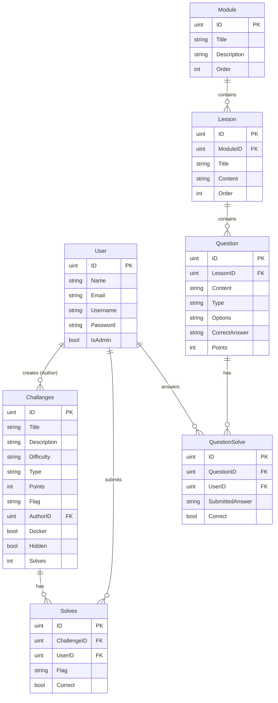

# Database Entity-Relationship Diagram (ERD)

This diagram outlines the complete SQLite/PostgreSQL schema architecture utilized by the GDSC CTF Backend, illustrating both the core hacking mechanics and the LMS structural relationships.

