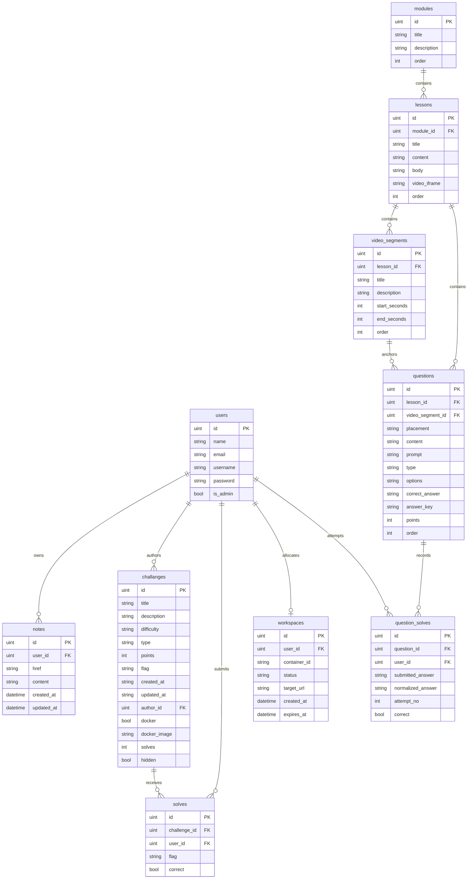

# Database ERD

This diagram reflects the current GORM-managed schema used by the backend.
`Container` and `Settings` exist as models in code, but they are not part of the current auto-migration set.

